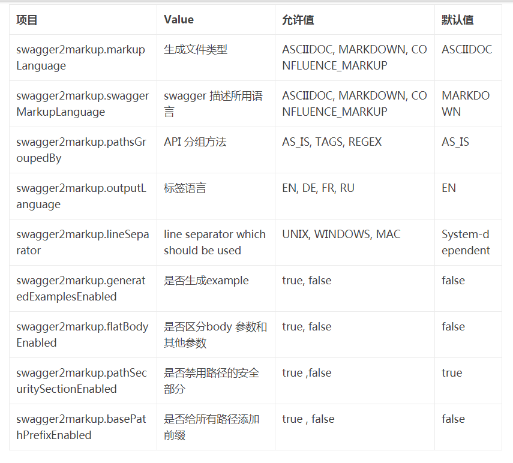

# swagger-starter-demo

spring-boot-starter-swagger使用样例

# 使用流程

1. 执行 mvn test 创建文件
2. 执行 mvn clean asciidoctor:process-asciidoc 根据生成的asciidoc转html
3. 文件位置./swagger-html/src/docs/asciidoc/html


# sagger2markup生成文件的配置可用配置


```java
 //    输出Markdown格式
          Swagger2MarkupConfig config = new Swagger2MarkupConfigBuilder()
                  .withMarkupLanguage(MarkupLanguage.MARKDOWN)
                  .withOutputLanguage(Language.ZH)
                  .withPathsGroupedBy(GroupBy.TAGS)
                  .withGeneratedExamples()
                  .withoutInlineSchema()
                  .build();

```

```
项目	Value	允许值	默认值
swagger2markup.markupLanguage	生成文件类型	ASCIIDOC, MARKDOWN, CONFLUENCE_MARKUP	ASCIIDOC
swagger2markup.swaggerMarkupLanguage	swagger 描述所用语言	ASCIIDOC, MARKDOWN, CONFLUENCE_MARKUP	MARKDOWN
swagger2markup.pathsGroupedBy	API 分组方法	AS_IS, TAGS, REGEX	AS_IS
swagger2markup.outputLanguage	标签语言	EN, DE, FR, RU	EN
swagger2markup.lineSeparator	line separator which should be used	UNIX, WINDOWS, MAC	System-dependent
swagger2markup.generatedExamplesEnabled	是否生成example	true, false	false
swagger2markup.flatBodyEnabled	是否区分body 参数和其他参数	true, false	false
swagger2markup.pathSecuritySectionEnabled	是否禁用路径的安全部分	true ,false	true
swagger2markup.basePathPrefixEnabled	是否给所有路径添加前缀	true , false	false
2.2 swagger2markup 插件生成 asciidoc
```
